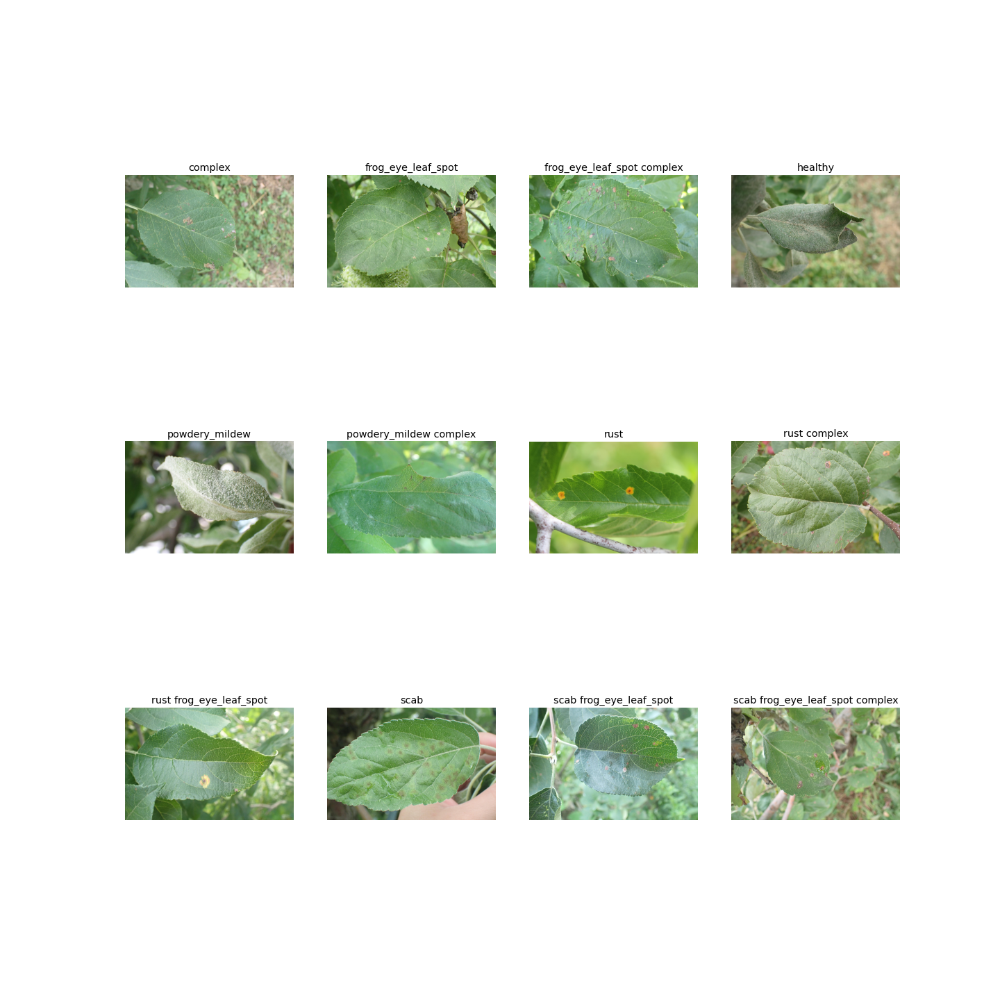
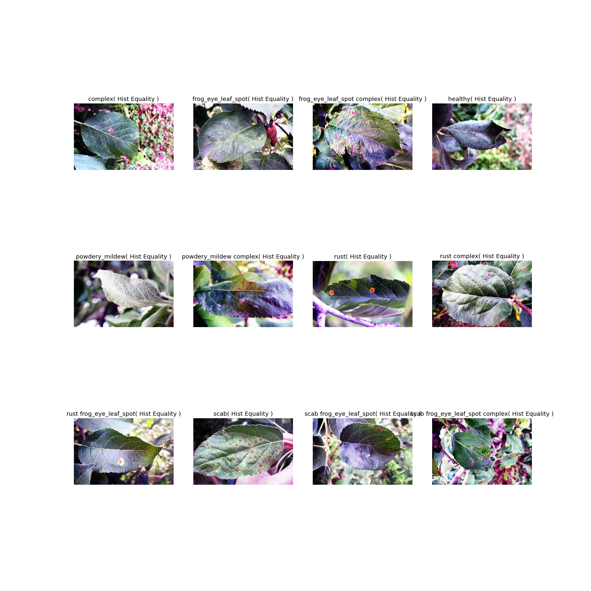
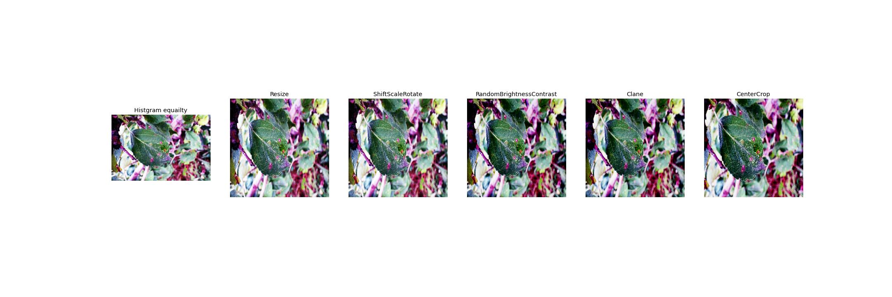

<div align = "center">
    <h1 font-size = 30> 
        <font color = "pink">Plant Pathology 2021 - FGVC8</font>
    </h1>
</div>
<div align = "center">
    <h1 font-size = 20> 
        <font color = "blue">Identify the category of foliar diseases in apple trees</font>
    </h1>
</div>

[*Completion link*](https://www.kaggle.com/c/plant-pathology-2021-fgvc8)
# Download Dataset

**BaiDu Network Disk** 

[Get Data](https://pan.baidu.com/s/1_PbKnKdeade9JIIgGvxr7A)

**passward** `kwj4` 

if you have downloaded the dataset,the document structure should be as follows:

```
../
    ./train_images
    ./test_images
    train.csv
    sample_submission.csv
```

where `../` is `ROOT` in `config.py`

## Sample Data and EDA

### Data

There are some different classes of image as below:

<div align = "center">
    
</div>

### EDA

#### Step 1 (**Key Step**)

<div align = "center">
    
</div>

#### Another Step

<div align = "center">
    
</div>

# SoftWare Version and Installation

Below are the versions of `opencv-python`, `torch`, `torchvision`, `rich`, `warmup_scheduler`, and `numpy` currently running at the time of writing this:

* `opencv-python` : 4.5.5.64 
* `torch` : 1.10.0+cu102 
* `torchvision` : 0.11.0+cu102 
* `rich` : 10.16.2  
* `warmup_scheduler` : 0.3.2 
* `numpy` : 1.20.0 

Install **rich** **accelerate** **DataLoaderX** **albumentations** and **warmup_scheduler** 

```shell
pip install git+https://github.com/ildoonet/pytorch-gradual-warmup-lr.git
pip install rich
pip install accelerate
pip install prefetch_generator 
pip install -U albumentations
sudo apt-get install libturbojpeg
pip install -U jpeg4py
```

or you can use `install.sh` to configure

# Custom Model

Add new model file to  `./models/`

**example** 

`./models/new_model.py`

```py
import torch
import torch.nn as nn
class Model(nn.Module):
    def __init__(self,in_channle,num_classes):
        super().__init__()
        pass
    def forward(self):
        pass
```

# Custom transform

Add code in `vision_transform`


# Configure parameters

In `config.py`,you can see a dict  as follows:

```py
parameter = {
    "ROOT": r"/mnt/d/dataset",
    "dataset_csv": r"train.csv",
    "batch_size": 32,
    "num_workers" : 8,
    "learning_rate" : 1e-3,
    "val_size" : 0.2,
    "seed" : 12,
    "epochs":10,
    "num_classes" : 12,
    "in_channel" : 3,
    "image_size" : (128,128)
}
```
